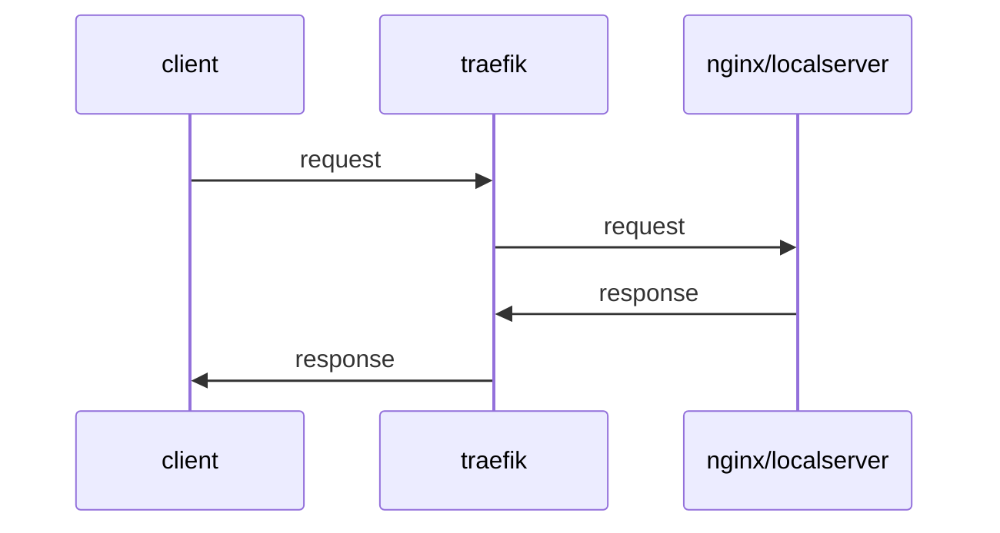

<!--more-->

其中 traefik nginx php-serve 环境由 docker-compose 统一控制。在功能上 ng 本身也是可以像traefik 一样代理许多服务的流量，但是 traefik 的 providers 功能可以更灵活的转发配置环境。既可以是监视文件变化，也可以调用接口更新。作为本地环境本身资源消耗极小。总的来说 ng 也能实现，但是 traefik 用来做本地环境的总网关更灵活方便。ng 只用作 php-fpm 的组合工具即可。

