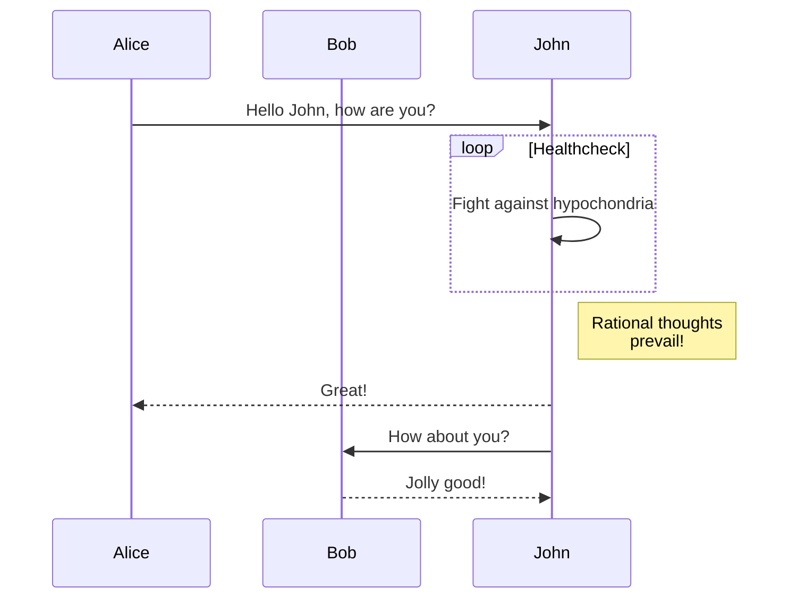
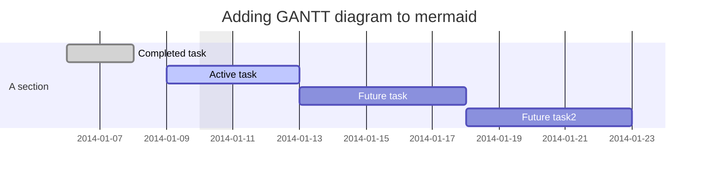
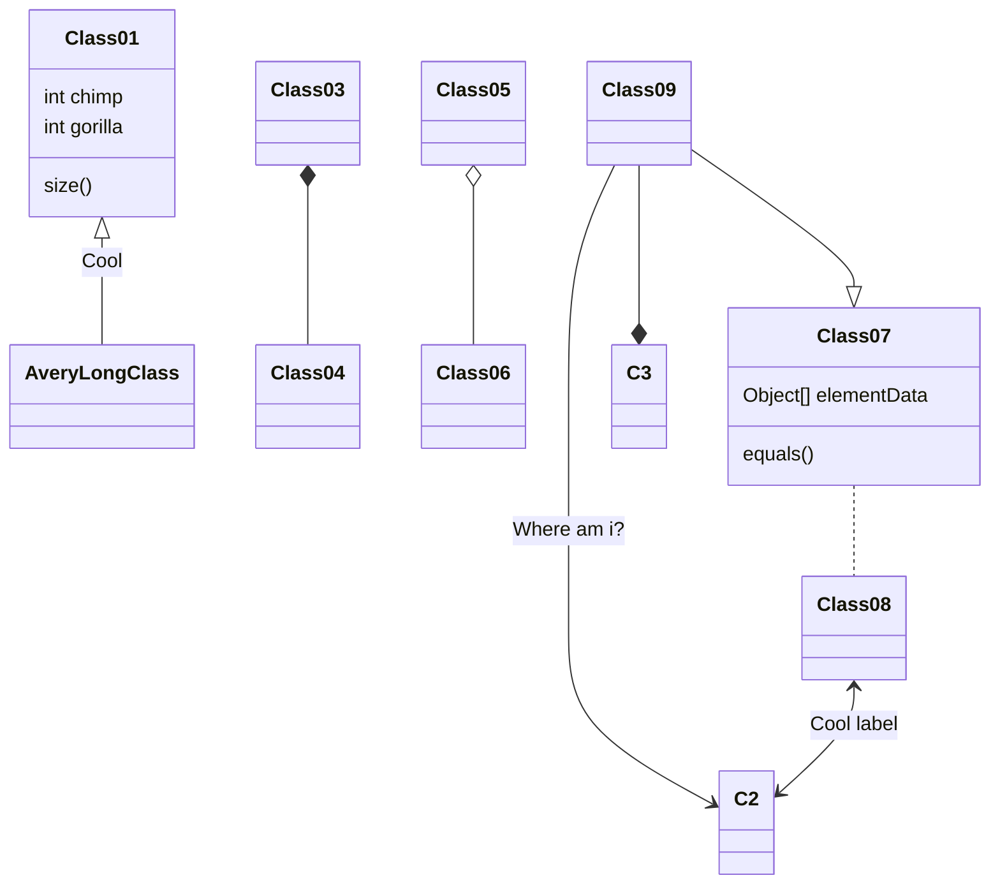
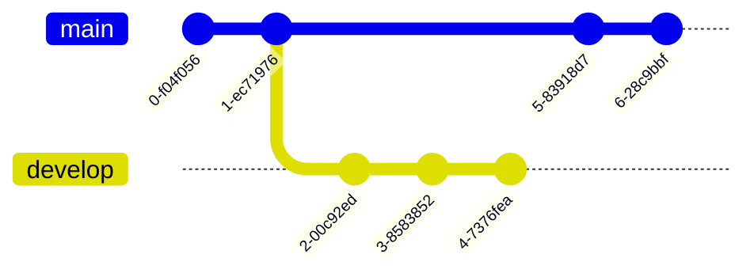
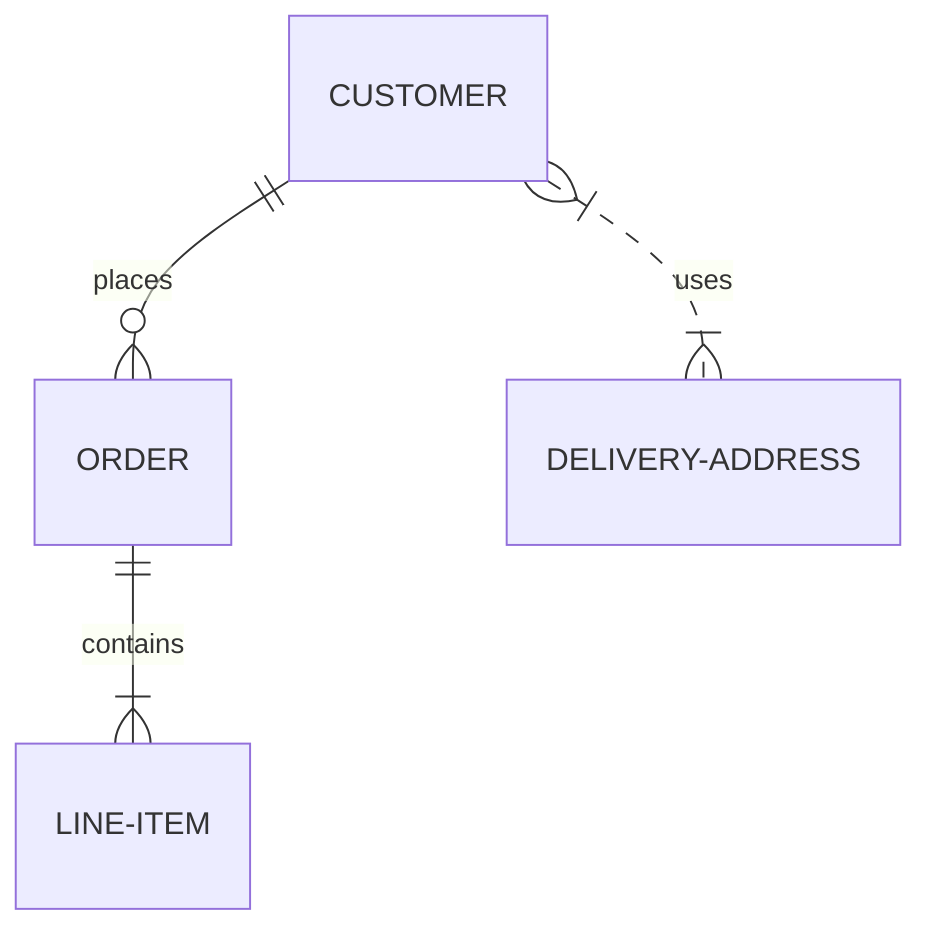
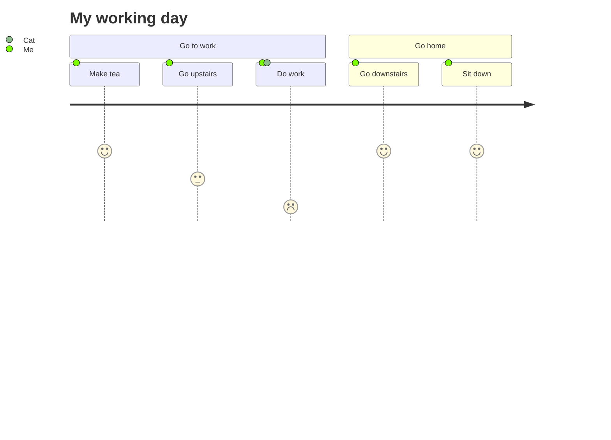

- [文档](#文档)
- [math](#math)
  - [安装文档](#安装文档)
  - [语法](#语法)
- [tag 插件](#tag-插件)
  - [文档](#文档-1)
  - [语法](#语法-1)
  - [Warning Header](#warning-header)
- [mermaid文档](#mermaid文档)
  - [文档](#文档-2)
  - [代码块格式](#代码块格式)
  - [语法](#语法-2)
    - [流程图 Flowchart](#流程图-flowchart)
    - [序列图](#序列图)
    - [甘特图](#甘特图)
    - [类图](#类图)
    - [Git 图](#git-图)
    - [实体关系图](#实体关系图)
    - [用户旅程图](#用户旅程图)

> 本文为 202206 版本升级后的语法大全总结


<!--more-->

# 文档

https://theme-next.js.org/

# math

## 安装文档

https://theme-next.js.org/docs/third-party-services/math-equations.html

## 语法

行内 :  

$\sum_{k=1}^N k^2$

剧中 :

$$\begin{equation} \label{eq1}
e=mc^2
\end{equation}$$

更详细的语法可以查询 `mathJax`


----

# tag 插件

## 文档
https://theme-next.js.org/docs/tag-plugins/

## 语法

```
Elegant in code, simple in core
```

Elegant in code, simple in core

```

## Warning Header
**Welcome** to [Hexo!](https://hexo.io)

```


## Warning Header
**Welcome** to [Hexo!](https://hexo.io)



---

# mermaid文档

<!-- 标题有bug 如果只写 英文名称导致后续渲染不出来 -->

## 文档
https://theme-next.js.org/docs/tag-plugins/mermaid.html?highlight=mermaid  

https://mermaid-js.github.io/mermaid/#/  


## 代码块格式

两种包裹方式

```


```


~~~
```mermaid
type
```
~~~


## 语法

### 流程图 Flowchart


### 序列图




### 甘特图




### 类图



### Git 图



### 实体关系图 



### 用户旅程图

