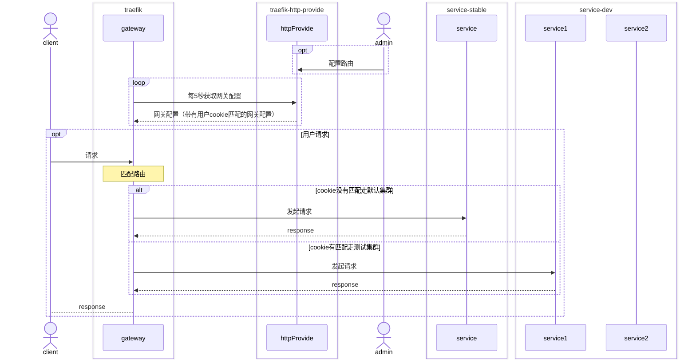
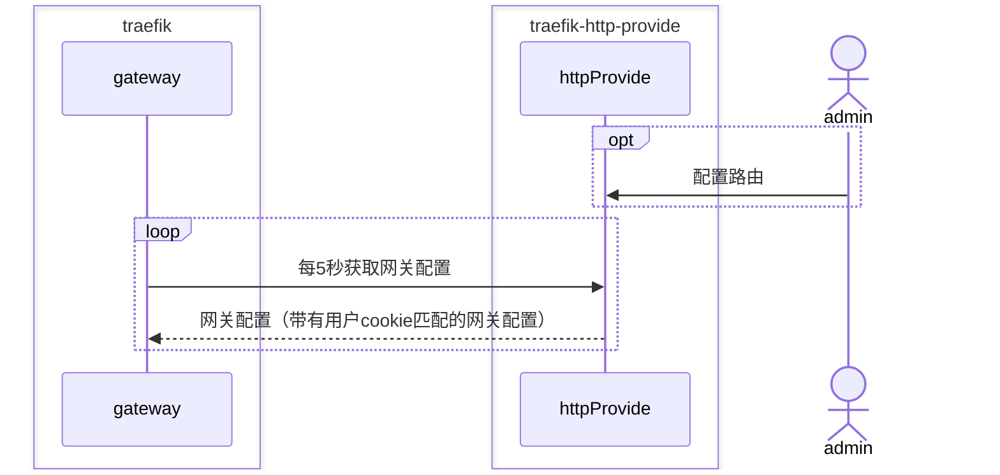
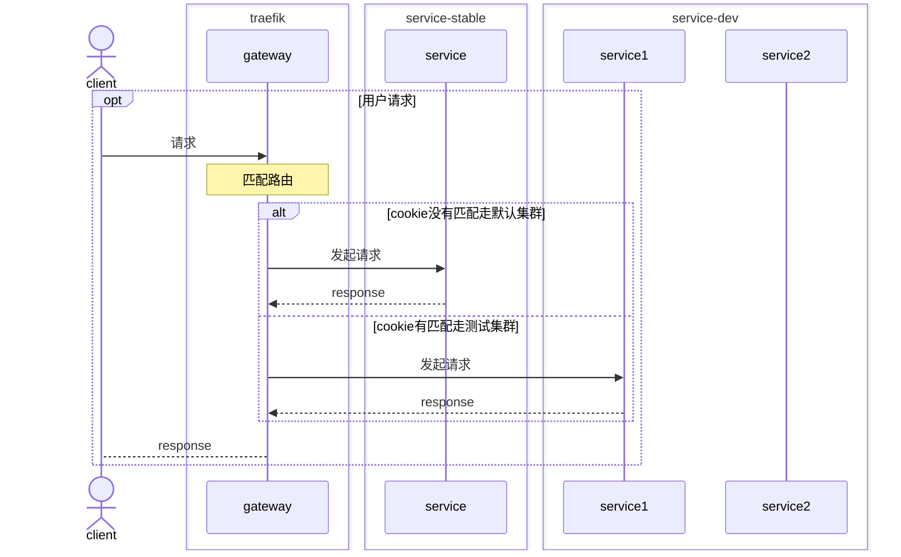
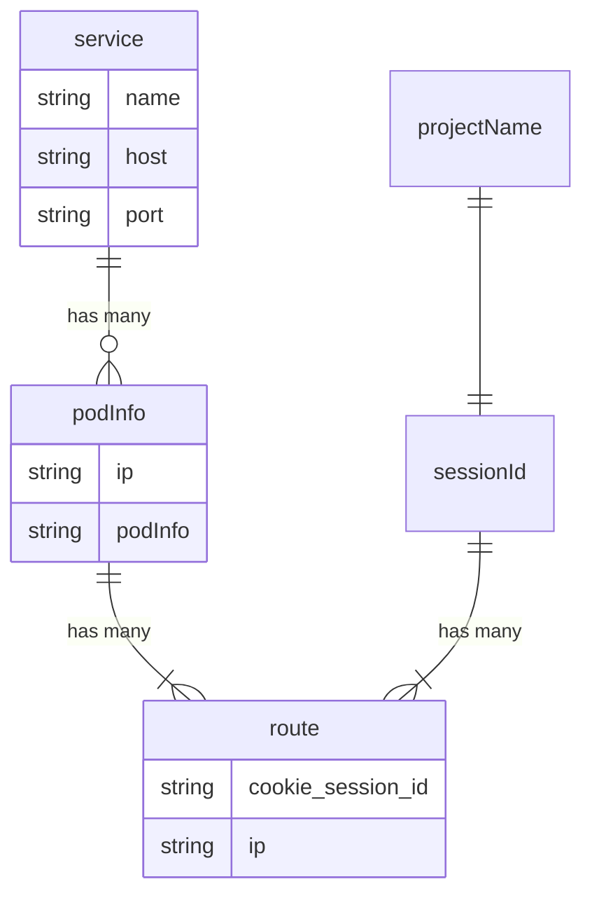
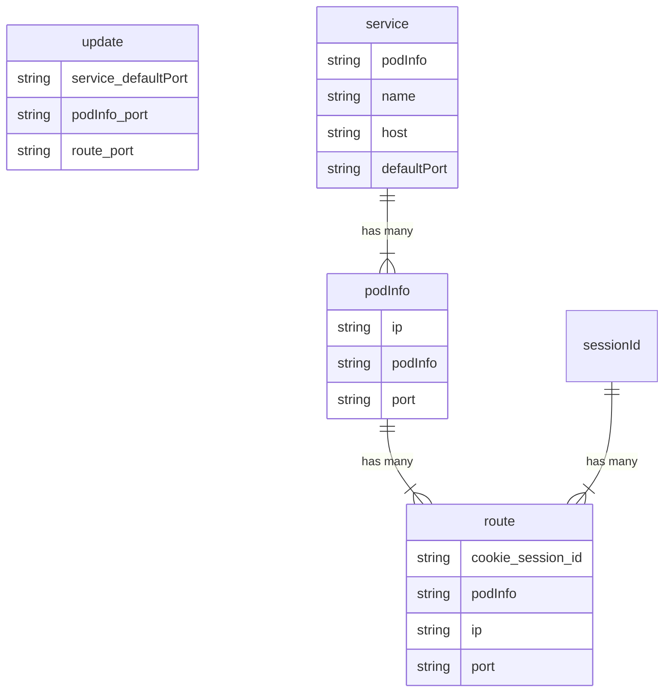
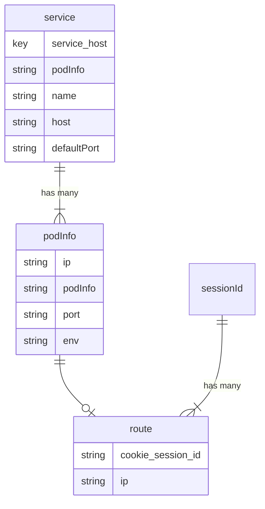

基于 traefik provider 的多环境网关

<!--more-->


# 完整时顺



# 网关配置



# 请求过程



# traefik 是什么 

[traefik](https://doc.traefik.io/traefik/)


> Traefik is an open-source Edge Router that makes publishing your services a fun and easy experience. It receives requests on behalf of your system and finds out which components are responsible for handling them.

对于大多数功能，对与一些普通功能 ng 和 traefik 是有着重叠。

Traefik使用简单的YAML配置文件，并支持动态配置。它可以自动检测运行的服务，并相应地更新代理规则。

# traefik 怎么用

traefik 可以从 [github/releases](https://github.com/traefik/traefik/releases) 下载

```sh
traefik --configfile=/traefik/traefik.yml
```

- EntryPoints
  - web(目前web集群的转发)
  - udp
  - tcp(例如转发scf接口)
- Routers
  - 可以对上述EntryPoints分别做路由规则，支持针对host/path/header做匹配，支持正则
- Middlewares
  - 重定向，路径替换等
- Services
  - 具体的服务详情
- **Provider**
  - 动态的 traefik 配置 ，可以动态配置 routers，services等。可以是文件也可以是

# traefik-http-provider 当前设计+优化后设计+可以改进点

traefik-http-provider 只需要满足接口返回的为traefik可以识别的配置即可。






service 不应该和host绑定，多个host对应的 service可能是同一个。
集群配置不应当用ip作为id。某些ip可能对应多个service，每个service的端口是相同的。

